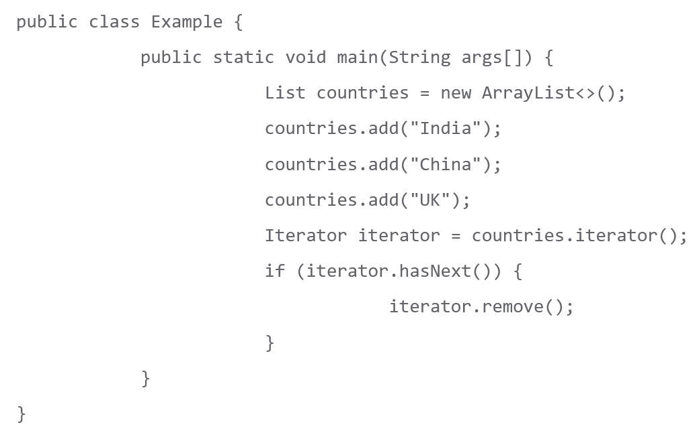

# Basic Java Elements

## Packages

Some packages available in Java:

* java.lang - provides classes that are fundamental to the design of Java - class Thread belongs to this package. Other classes include the data type wrapper classes (i.e. Integer), Math, String, Object (root of class hierarchy), Runtime, System.
* java.io - classes that deal with system input and output through data streams, serialization and the file system i.e. File, FileReader & FileWriter, InputStream, PrintStream etc.
* java.net - classes for implementing network applications i.e. URL, Socket, ServerSocket, Proxy etc.
* java.util.concurrent - classes useful for concurrent programming

### Importing Packages

The import statement can be used to make a specific or all classes visible in the current Java source file. It can't be used to make just a subset of classes visible (unless you're individually importing all of them). When an entire package is imported, the sub-packages must still be explicitly imported. Once imported, classes don't need their fully qualified type names.

## Naming Conventions

Classes - nouns, mixed case with first letter always capitalised (including first letter of internal word). Use whole words, avoiding acronyms unless more commonly used.

Interfaces - capitalized like class names.

Methods - verbs, camelCase.

Variables - camelCase, shouldn't start w/ _ or $ even if allowed, sort and meaningful.

Constants - uppercase, words separated by _ i.e. int MIN_WIDTH;

___



The iterator.remove() will throw an *IllegalStateException* because the iterator.next() function hasn't been called yet (hasNext() just checks if there is a next element in the iterator), It would also be thrown if remove() was called again before another call to next(). The next() method returns the next item in the iterator, then increments the pointer to point to the next item. For example:

```java
    while (iterator.hasNext())
    {
        if (iterator.next().equals("China"))
        {
            iterator.remove(); //will remove the current element if it equals "China"
        }
        iterator.remove(); //will throw an IllegalStateException because the element the iterator is still pointing at has already been removed 
    }
```

